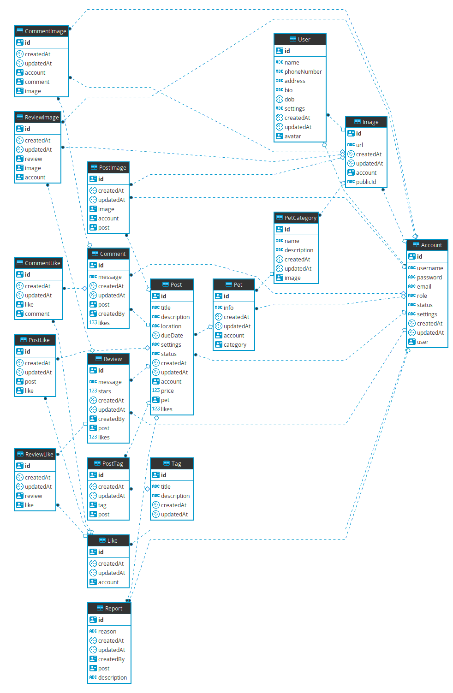

# service

[](https://hitsofcode.com/view/github/PetIsland/service)
[](https://github.com/PetIsland/service/blob/master/LICENSE)

🚀🌌 Powerful service for PetIsland.


## Features

- Using ESNext
- Setup Babel, ESLint, Prettier and Husky.
- Having Basic authentication and authorization.
- Setup a basic RESTful API.
- Using Prisma and PostgreSQL.
- Uploading image with [image-service](https://github.com/cuongw/image-service)
- And more features ...

## Prepare

- [Node](https://nodejs.org/en/)
- [Yarn](https://yarnpkg.com/en/)
- [Docker](https://phoenixnap.com/kb/how-to-install-docker-on-ubuntu-18-04)
- [Docker Compose](https://docs.docker.com/compose/install/)

## How to use?

### Step 1: Create .env file

Please follow .env.example file.

### Step 2: Launch Prisma and the connected database

```sh
$ sudo docker-compose up -d
```

### Step 3: Deploy the Prisma datamodel and generate Prisma client

```sh
$ yarn prisma:deploy
```

### Step 4: Install dependencies and run the project

```sh
$ yarn
$ yarn start:dev
```

## Database diagram



Build with 🙌 and ❤️

## License

Apache © [cuongw](https://github.com/cuongw)
